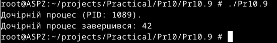

# Практична робота №10
Цей репозиторій cтворений для перегляду виконання практичної роботи №10 з дисципліни "Архітектура системного програмного забезпечення", виконане студентом Щур Р.І., групи ТВ-32.

## Завдання №2.7
  1)Створити просту оболонку, яка запускає команди користувача.
  
  2)Зберегти як dumbsh.c.
  
  3)Скомпілювати.
 
  4)Запустити.

## Виконання

Код, який наданий у практичній роботі, працює коректно, виконуючи команди ls та whoami у дочірньому процесі.

## Завдання №2.9 
## Виконання

Використав фрагмент коду, який наданий в практичній роботі, та дописав фрагменти,які потрібні були для повноцінної роботи програми. Тепер програма створює дочірній процес, чекає поки він завершується і виводить повідомлення про завершення.

## Завдання №2.10 
## Виконання

Використав фрагмент коду, який наданий в практичній роботі, та дописав фрагменти,які потрібні були для повноцінної роботи програми. Тепер програма циклічно 3 дочірні процеси, чекає поки вони завершуться і виводить повідомлення про завершення.
